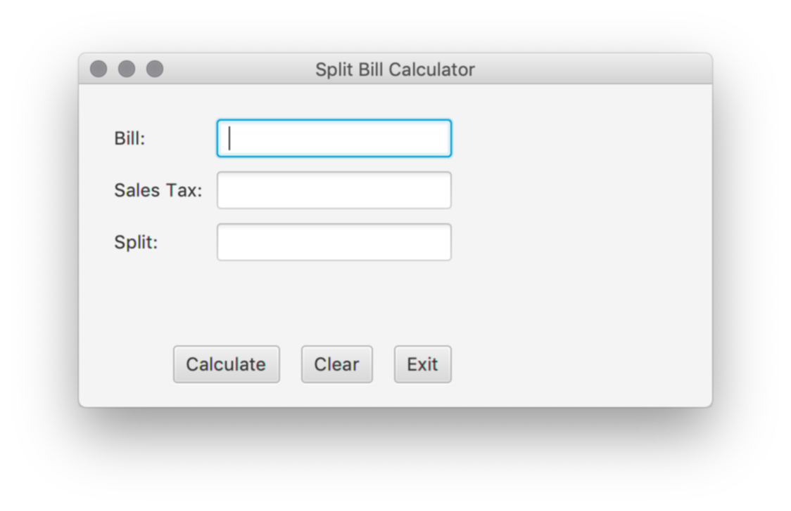
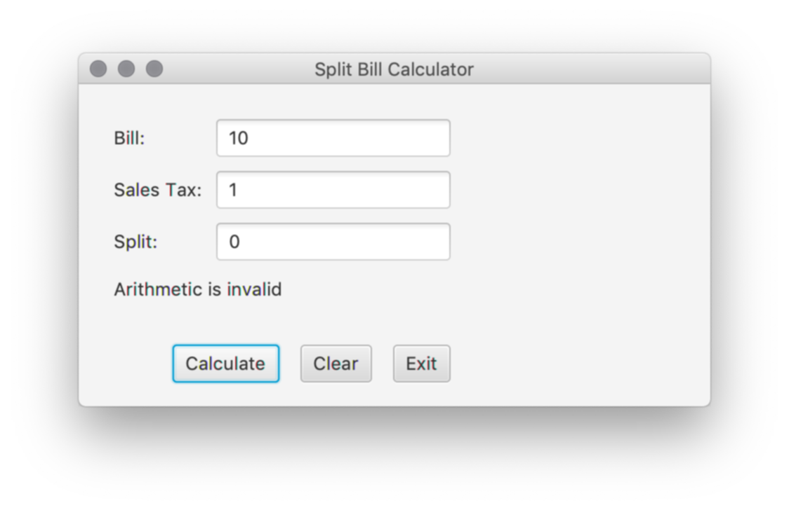

## Lab Exercise 11/14/2019

A JavaFX application needs a primary launch class. This class has to extend the [javafx.application.Application][1] class which is a standard class in Java since Java 8.

You’ll be building this Split Bill Calculator interface with JavaFX. You can work in small teams or individually on this task. Submit the link here: https://docs.google.com/forms/d/e/1FAIpQLSdgIVgu56J9oI_PZfXWVTN5zCvgi47myXm4VuXP7NpxKoZJSw/viewform

*Note: JavaFX comes with Java 8. Any newer versions of Java (9+) will require separate installation of JavaFX.*

The fields to include in your GUI are (in any sensical order and layout):
* Bill = any whole or decimal number
* Sales Tax = this figure will be converted to a percentage. 5 = 5%
* Split = number of ways to split the bill.

Final value = [Bill + (Bill * sales tax as %)] / Split

Buttons:
* Calculate will calculate the total. Make sure you have exception handling built in.
* Clear will clear the text fields.
* Exit will close the GUI applet.

Example: with the fields filled in

Error handling:

[1]: https://docs.oracle.com/javase/8/javafx/api/javafx/application/Application.html
[2]: https://docs.oracle.com/javase/8/javafx/api/javafx/scene/layout/GridPane.html
[3]: https://docs.oracle.com/javase/8/javafx/api/javafx/scene/control/TextInputControl.html
